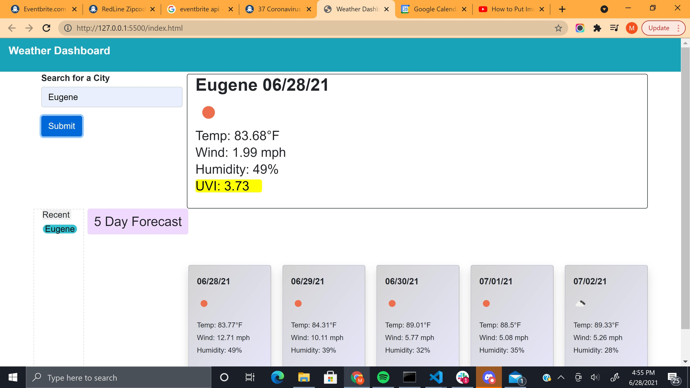

# 06-weather-dashboard

## Link

https://mmurphy222.github.io/06-weather-dashboard/

## Site



### User-Story

```
AS A traveler
I WANT to see the weather outlook for multiple cities
SO THAT I can plan a trip accordingly
```

### Description

The HTML and css are standard for this page, bootstrap grid was used to set up the layout for the page. Bootstrap cards were used for the five day forecast. Elements were predominantly generated in HTML rather than in javascript.

### License

This website was used to get UVI rankings and their ratings

https://19january2017snapshot.epa.gov/sunsafety/uv-index-scale-1_.html
